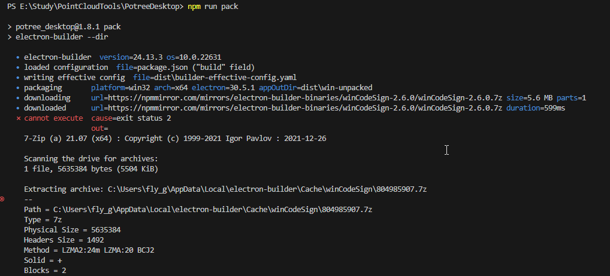

# About
This program is oirginted from [PotreeDesktop]([URL_ADDRESS](https://github.com/potree/PotreeDesktop)) v1.8.1, Added Electron-Builder and Vue3.

[PotreeDesktop]([URL_ADDRESS](https://github.com/potree/PotreeDesktop)) is a desktop/portable version of the web-based point cloud viewer.

A desktop/portable version of the web-based point cloud viewer [Potree](https://github.com/potree/potree), thanks to [Electron](https://electronjs.org/).

* This version allows you to load [converted point clouds](https://github.com/potree/PotreeConverter) from your hard disc or USB drive. It's also portable so you can put your models together with the viewer on a USB drive and open it wherever you go. 
* It's only been tested on windows at the moment. It may not work on other systems or you may only be able to use it on the same Operating System that you've initially built it on.
* Modify index.html to change which point cloud should be loaded by default.
* You can also drag&drop cloud.js files into the window to add point clouds to the scene.
* This desktop version is in a prototype state and as such it may be a bit awkward to use at times. 
In order to reset the viewer, you'll have to click "window->reload".

# 开发和打包

## 安装依赖
```bash
pnpm i
```

## 运行
```bash
pnpm start
```

## 打包
### 生成可执行文件
```bash
pnpm run pack
```
[注意]若报下述错误，可以管理员方式运行VSCode或者以管理员方式运行CMD或PowerShell后再执行该命令。


### 生成安装包
```bash
npm run dist
```

# 代码结构说明
在 git bash 命令窗口中生成 tree 目录的命令(忽略指定文件夹后存入到 tree.md 文档中)如下:

```
tree -I "node_modules|dist" > tree.md
```

```
|-- PotreeDesktop.bat 		-- 启动程序的bat文件；
|-- README.md				-- 项目的自述文件,包含项目介绍、安装说明、使用方法等；
|-- electron				-- Electron相关的源代码，包括主进程和IPC通信的内容，渲染进程通过vue3在src中实现；
|   `-- main.js				-- Electron主进程的入口；
|   `-- preload.js			-- 在渲染进程中暴露 Electron API；

|-- libs					-- 第三方库目录,存放第三方库的源代码；
|-- public					-- 静态资源目录,存放图片、字体等不需要构建的文件。
|   |-- icon.ico
|   |-- share.png
|   `-- title-Light.png
|-- src						-- vue源代码目录,包含组件、视图、路由、状态管理和工具函数等；
|   |-- assets				-- 存放静态资源如图片、样式和字体等
|   |-- components			-- 存放可重用的Vue组件；
|   |-- i18n				-- 国际化；
|   |-- views				-- 存放应用程序的视图组件，如 HomeView.vue 和 SettingsView.vue；
|   |-- store				-- 存放Pinia状态管理的相关代码,如用户信息、场景数据、选择的视图等；
|   |-- router				-- 管理应用程序路由，如主页、关于页、场景页等；
|   |-- utils				-- 存放工具函数等；
|-- index.html				-- 应用程序的HTML人口点；
|-- package.json			-- NPM配置文件，记录了项目的元数据、依赖项、脚本命令等。
```


# LICENSE

* BSD 2-clause license. (free to use, preservation of copyright notice/attribute when redistributing)

# Getting Started

* Install [Node.js](https://nodejs.org/en/)
* Execute PotreeDesktop.bat
* Drag and Drop a las or laz file to convert and load it.
* Drag and Drop a previously converted point cloud to load it. 
